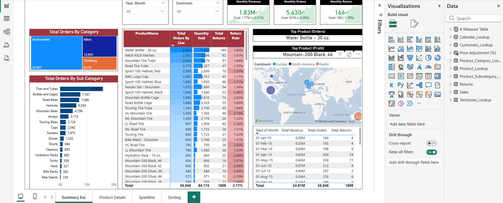
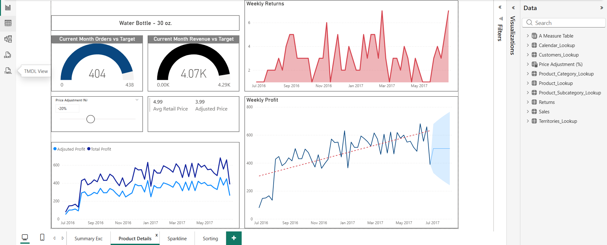
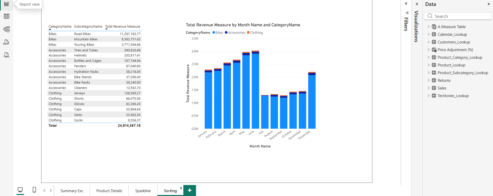
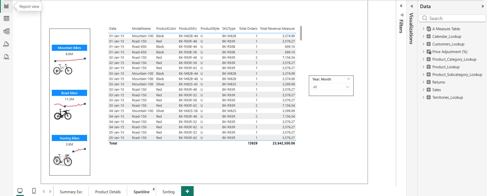
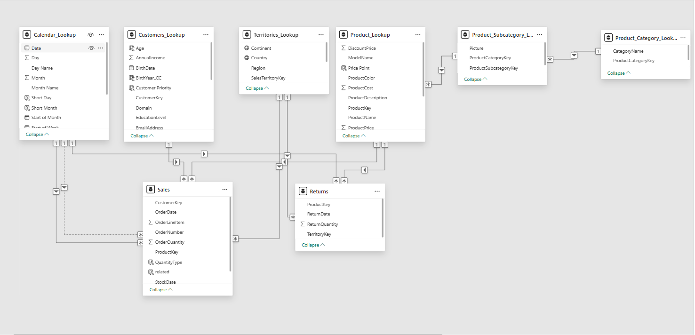

# Power-BI-Dashboard

A comprehensive Power BI project that visualizes sales data including revenue, orders, returns, and product performance. Designed for interactive exploration of sales trends, product metrics, and geographic insights.

---

## Features

- Total Orders by Category and Subcategory  
- Product-wise Total Orders, Quantity Sold, Returns, and Return Rate  
- Monthly Revenue, Orders, and Return Metrics  
- Top Products by Orders and Profit  
- Interactive Map Visualization of Sales by Continent  
- Time-series trend analysis  
- Sparkline visuals for quick trend spotting  

---

## Screenshots

**Dashboard Overview**  
  

**Product Details**  
  

**Sorting Example**  
  

**Sparkline Visuals**  
  

**Model View**  

---

## Data

The sample dataset used in this project is located in the `data/` folder.  

---

## Usage

1. Open Power BI Desktop.  
2. Load the `Sales_Report.pbix` file.  
3. Explore the visuals and slicers to analyze sales data.
